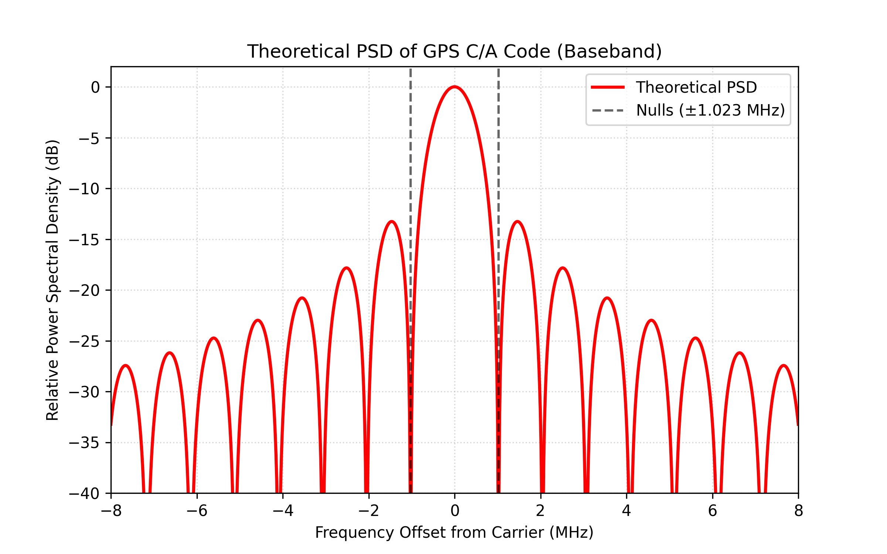

# Power Spectrual Density and Correlation of GNSS signals

## GPS C/A L1 code

Basic signal structure is composed from carrier (L1 band, 1.5GHz) and spreading code (1.023MHz, chip rate, 1023 chip) and data (50 bps).

Multiplied the $C(t)D(t)$ with carrier wave $\cos(2\pi f_c t)$, its theoretical PSD is PSD of 1.023MHz rectified wave form. The shape is Fig.1.

$$
G(f) = \frac{\sin^2(\frac{\pi f}{f_c})}{\left(\frac{πf}{fc}\right)^2}
$$

