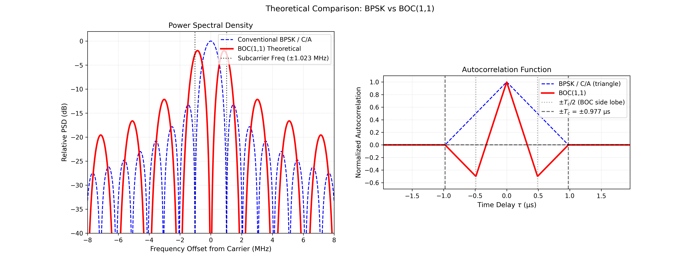
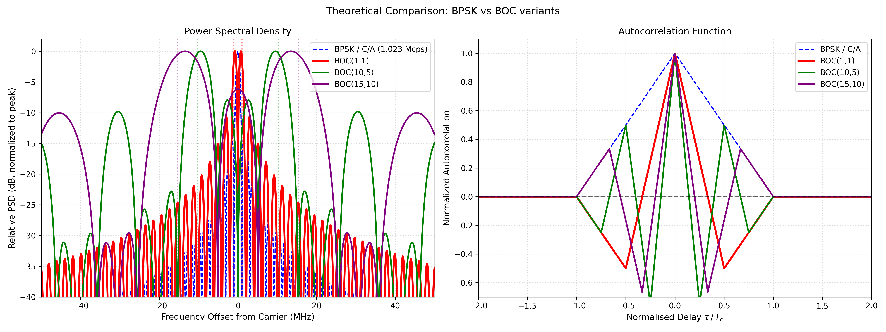

# Power Spectral Density and Correlation of GNSS signals

## BPSK (Binary Phase-Shift Keying)

Basic signal structure is composed from carrier (L1 band, 1.5GHz) and spreading code (1.023MHz, chip rate, 1023 chip) and data (50 bps).

Multiplied the $C(t)D(t)$ with carrier wave $\cos(2\pi f_c t)$, its theoretical PSD is PSD of 1.023MHz rectified wave form. The shape is Fig.1.

Chip period $T_d = \frac{1}{f_c}$

$$
g(t) = \text{rect}_{T_d} (t)
$$

The simbles are $a_k$, signal can be written $
x(t) = \sum_{k=-\infty}^{\infty} a_k g(t-\frac{k}{T_d})
$

If $a_k$ can be assumed random and its frequency property can be assumed uniform, we can calculate its PSD only from $g(t)$. So, here after I calculate PSD form $g(t)$.

$$
\Phi(f) = T_d \mathbf{sinc}(\pi fT_d)
$$

For uncorrelated random chips ($E[a_k a_j] = \delta_{kj}$, zero mean, unit variance),
the PSD of $x(t)$ follows from the Wiener–Khinchin theorem:

$$
G_x(f) = \frac{|\Phi(f)|^2}{T_c}
= \frac{T_c^2 \,\text{sinc}^2(\pi f T_c)}{T_c}
= T_c \,\text{sinc}^2(\pi f T_c)
$$

Normalising by the peak value $G_x(0) = T_c$ gives the relative PSD:

$$
\hat{G}(f) = \text{sinc}^2(\pi f T_c)
$$

Expanding the normalised sinc with $T_c = 1/f_c$:

$$
G(f) = \frac{\sin^2(\frac{\pi f}{f_c})}{\left(\frac{\pi f}{f_c}\right)^2}
$$

**Left — PSD.**
The spectrum is $\text{sinc}^2$-shaped, centered at $f = 0$.
The main lobe spans $[-f_c,\, +f_c]$ (null-to-null bandwidth $= 2f_c = 2.046\ \text{MHz}$).
Side lobes roll off as $1/f^2$, falling to approximately $-13\ \text{dB}$ at the first side lobe.
In a real receiver the front-end filter limits the captured bandwidth; a typical 2 MHz double-sided filter retains mostly the main lobe.

**Right — Autocorrelation function (ACF).**
The ACF of a rectangular chip pulse is the convolution of the pulse with itself, which gives a triangle:

$$
R(\tau) = \max\!\left(1 - \frac{|\tau|}{T_c},\; 0\right)
$$

It peaks at $\tau = 0$ and reaches zero at $|\tau| = T_c \approx 0.977\ \mu\text{s}$.
The constant slope $1/T_c$ within $|\tau| < T_c$ is exploited by the DLL (Delay Lock Loop):
the Early-minus-Late discriminator measures the slope asymmetry to estimate the tracking error.
Narrowing the correlator spacing (e.g., narrow correlator, strobe) improves noise immunity
and multipath resistance without changing the underlying triangular shape.

## BOC(1,1)

BOC (Binary Offset Carrier) places a square-wave subcarrier of frequency $f_s$ on top of
the BPSK spreading code.
The chip waveform alternates sign every half-subcarrier period, splitting the spectral power
away from DC into two lobes centred at $\pm f_s$.
For BOC(1,1), $f_c = f_s = 1.023\ \text{MHz}$ and the subcarrier completes one full cycle
per chip ($N = 2$ half-cycles per chip).

The PSD formula for even $N$ is:

$$
G_\text{BOC}(f) = f_c \left(\frac{\sin\!\left(\frac{\pi f}{f_c}\right)\sin\!\left(\frac{\pi f}{2f_s}\right)}{\pi f}\right)^{\!2} \tan^2\!\left(\frac{\pi f}{2f_s}\right)
$$

Both curves are plotted at **equal total power**: each PSD is normalised so that its integral
over all frequencies equals 1, and the reference (0 dB) is the BPSK peak at $f = 0$.

**Left — PSD.**
The BPSK/C/A spectrum (blue dashed) has its peak at $f = 0$.
The BOC(1,1) spectrum (red solid) has two main lobes centred at $\pm f_s = \pm 1.023\ \text{MHz}$
and a deep null at $f = 0$.
Each BOC lobe carries roughly half the total power in a bandwidth similar to the BPSK main lobe,
so its peak spectral density is approximately 3 dB lower (visible in the figure as ≈ −2 dB).
The frequency separation from DC improves isolation from low-frequency interference
and from GPS L1 C/A on the same band, which is the motivation for using BOC in Galileo E1
and GPS L1C.

**Right — ACF.**
The BOC(1,1) autocorrelation (red solid) is piecewise linear with three segments per side:

$$
R_\text{BOC}(\tau) = \begin{cases}
1 - 3|\tau|/T_c & |\tau| \le T_c/2 \\
-1 + |\tau|/T_c & T_c/2 < |\tau| \le T_c \\
0 & |\tau| > T_c
\end{cases}
$$

Key features compared with BPSK:

- **Steeper central slope** ($3/T_c$ vs $1/T_c$): a narrower main peak, which makes the DLL
  discriminator more sensitive to small timing errors and improves range measurement precision.
- **Side lobes at $\pm T_c/2$ (value $\approx -0.5$)**: these are secondary maxima that can cause
  false lock in a standard DLL if the initial code phase is off by $\pm T_c/2$.
  Receiver designs for BOC must use an unambiguous acquisition strategy (e.g., BPSK-like
  envelope, bump-jumping, or MBOC modifications) to avoid locking onto a side lobe.

## Higher-order BOC: BOC(10,5) and BOC(15,10) / AltBOC

The figure below extends the comparison to two higher-order variants.
All signals follow the same BOC$(m, n)$ notation: subcarrier frequency $f_s = m f_0$,
chip rate $f_c = n f_0$ ($f_0 = 1.023\,\text{MHz}$), giving $N = 2m/n$ subcarrier
half-cycles per chip.

| Signal     | $m$ | $n$ | $f_s$ (MHz) | $f_c$ (MHz) | $N$ | Application         |
|------------|-----|-----|-------------|-------------|-----|---------------------|
| BOC(1,1)   |  1  |  1  |  1.023      |  1.023      |  2  | GPS L1C, Galileo E1 |
| BOC(10,5)  | 10  |  5  | 10.23       |  5.115      |  4  | GPS M-code          |
| BOC(15,10) | 15  | 10  | 15.345      | 10.23       |  3  | Galileo E5 (approx.)|

Each PSD is independently normalised to its own peak (0 dB).
The ACF x-axis is the normalised delay $\tau/T_c$ where $T_c = 1/f_c$ is each signal's own chip
period, so the curves are directly comparable regardless of chip rate.

**Left — PSD.**
The main lobes sit at $\pm f_s$, with higher-order side lobes spaced $2f_s$ apart.

- **BOC(10,5)** (green, $N=4$, even): main lobes at $\pm 10.23\,\text{MHz}$; the wider
  occupied bandwidth ($\approx 24\,\text{MHz}$) makes it resistant to narrowband jamming
  and is used for the GPS M-code military signal.
- **BOC(15,10)** (purple, $N=3$, odd): because $N$ is odd, the PSD formula uses
  $\cos^2(\pi f/f_c)$ rather than $\sin^2$, so the spectrum does **not** have a null at $f=0$;
  residual power near DC is visible in the figure.
  The main lobes peak near $\pm 15.345\,\text{MHz}$ with a wide occupied bandwidth of
  $\approx 51\,\text{MHz}$.

**Right — ACF.**
The central peak narrows with increasing $N$ (width $\approx T_c/N$), improving ranging
precision, while the sidelobe depth and count grow:

- **BOC(10,5)** ($N=4$): a very sharp central peak (width $\approx T_c/4$), with sidelobes
  at $\pm 0.25, \pm 0.75$ in normalised delay; the peak sidelobe level is $\approx -0.25$.
- **BOC(15,10)** ($N=3$): intermediate width ($\approx T_c/3$), three lobes per half-chip;
  the deepest sidelobe reaches $\approx -0.67$, creating a more severe false-lock risk than
  BOC(10,5) despite the lower $N$.

**Note on AltBOC.**
Galileo E5 uses **AltBOC(15,10)**, which is not a simple binary BOC.
AltBOC is a constant-envelope 8-PSK composite signal that simultaneously carries two
sub-bands — E5a (1176.45 MHz) and E5b (1207.14 MHz) — in phase quadrature, achieving a
combined double-sided bandwidth of $\approx 51\,\text{MHz}$.
The figure shows plain BOC(15,10) as a single-component approximation of its spectral envelope;
the true AltBOC differs in its inter-band sidelobe structure and requires a dedicated
AltBOC receiver to exploit the full wideband correlation peak.
