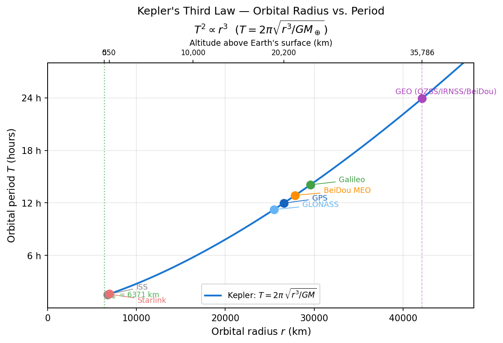

# Satellite Orbit Information via TLE (Two-Line Element)

## What is TLE?

**TLE (Two-Line Element set)** is a standard format for describing satellite orbits.
It is managed by the US NORAD (North American Aerospace Defense Command) and assigned to all tracked satellites worldwide.

A TLE consists of 3 lines:

```
STARLINK-1008
1 44714U 19074B   26214.44038421  .00026198  00000+0  33327-3 0  9998
2 44714  53.1485 206.1573 0006333  13.3005 346.8174 15.59194749371401
```

| Line | Contents |
|---|---|
| Line 0 | Satellite name (up to 24 characters) |
| Line 1 | NORAD catalog number, launch date, drag coefficient, etc. |
| Line 2 | Orbital elements (inclination, RAAN, eccentricity, argument of perigee, mean anomaly, mean motion) |

### Key Fields in Line 2

```
2 44714  53.1485 206.1573 0006333  13.3005 346.8174 15.59194749 371401
         ^----^  ^------^  ^-----^  ^-----^  ^------^ ^---------^
         Inclin. RAAN     Eccent.  Arg. of  Mean     Mean motion
         (deg)   (deg)    x10^-7   perigee  anomaly  (rev/day)
                                   (deg)    (deg)
```

- The **mean motion** gives the orbital period:
  $T \text{[min]} = \dfrac{1440}{\text{mean motion [rev/day]}}$

- The **inclination** determines the maximum latitude of the ground track (STARLINK-1008: 53.15 deg)

---

## How to Obtain TLE Data

### CelesTrak (recommended — free, no account required)

```
https://celestrak.org/NORAD/elements/gp.php?GROUP=<group>&FORMAT=TLE
https://celestrak.org/NORAD/elements/gp.php?NAME=<name>&FORMAT=TLE
https://celestrak.org/NORAD/elements/gp.php?CATNR=<norad_id>&FORMAT=TLE
```

| Parameter | Purpose | Example |
|---|---|---|
| `GROUP=<group>` | Entire constellation group | `GROUP=gps-ops` |
| `NAME=<name>` | Search by satellite name (partial match) | `NAME=STARLINK-1008` |
| `CATNR=<id>` | Search by NORAD catalog number | `CATNR=44713` |

**Note:** De-orbited satellites return HTTP 404.

### Space-Track (official — account registration required)

```
https://www.space-track.org/
```

The official US government database. The latest TLE for all satellites (excluding classified) is available.

---

## Major Satellite Groups and GROUP Names

Orbital radius $r$ is measured from Earth's center: $r = R_\oplus + h$, where $R_\oplus = 6{,}371\ \text{km}$.

| Constellation | GROUP Name | Altitude | Orbital Radius | Period | Inclination |
|---|---|---|---|---|---|
| GPS | `gps-ops` | ~20,200 km | ~26,570 km | ~12 h | ~55 deg |
| GLONASS | `glo-ops` | ~19,100 km | ~25,470 km | ~11.25 h | 64.8 deg |
| Galileo | `galileo` | ~23,220 km | ~29,590 km | ~14 h | 56 deg |
| BeiDou | `beidou` | MEO ~21,500 km / GEO ~35,790 km | ~27,870 km / ~42,160 km | ~12 h / 24 h | 55 deg / 0 deg |
| QZSS | `gnss` -> filter `QZS` | GEO/GSO ~35,790 km | ~42,160 km | ~24 h | 41--43 deg |
| IRNSS (NavIC) | `gnss` -> filter `IRNSS`/`NVS` | GEO/GSO ~35,790 km | ~42,160 km | ~24 h | 29--55 deg |
| Starlink | `starlink` | ~550 km | ~6,920 km | ~92 min | 53 deg / 70 deg |
| ISS | `stations` | ~400 km | ~6,770 km | ~92 min | 51.6 deg |

### Kepler's Third Law: Orbital Radius vs. Period

The orbital period follows Kepler's Third Law:

$$T = 2\pi \sqrt{\frac{r^3}{GM_\oplus}}, \quad GM_\oplus = 3.986 \times 10^{14}\ \text{m}^3/\text{s}^2$$

The figure below shows the theoretical curve together with the satellite constellations listed above.



---

## Example TLE: GPS Satellite

```
GPS BIIR-8  (PRN 16)
1 27663U 03005A   26214.23615372  .00000078  00000+0  00000+0 0  9990
2 27663  56.2789  45.6789 0123456  78.9012 280.4567  2.00565432 12345
```

- Altitude: ~20,200 km (Medium Earth Orbit: MEO)
- Orbital period: ~720 min (12 hours)
- Inclination: ~55 deg
- Completes 2 orbits per sidereal day (one orbit every ~12 h)
- Accuracy: km-level (use SP3/CLK precise ephemeris for positioning)

The ground track repeats the same pattern approximately every 12 hours.

---

## Example TLE: Starlink (LEO)

```
STARLINK-1008
1 44714U 19074B   26214.44038421  .00026198  00000+0  33327-3 0  9998
2 44714  53.1485 206.1573 0006333  13.3005 346.8174 15.59194749371401
```

- Altitude: ~550 km (Low Earth Orbit: LEO)
- Orbital period: 1440 / 15.59 approx **92.4 min**
- Inclination: 53.15 deg (sinusoidal ground track within +/-53 deg)
- Earth rotates ~4 deg/min, so each successive ground track shifts ~24 deg westward
- High atmospheric drag (term: `.00026198`) limits TLE validity to a few days

---

## Usage in This Project

`app/plot_orbit2d.py` automatically downloads and caches TLE data and plots ground tracks.

```bash
# Full GPS constellation (32 satellites)
uv run app/plot_orbit2d.py -c GPS

# Single Starlink satellite, 10 orbits
uv run app/plot_orbit2d.py -s STARLINK-1008 -n 10 -p mercator

# Specify by NORAD ID
uv run app/plot_orbit2d.py -s 44714 -n 5 -e 2027-06-01T12:00:00
```

Cache files are saved in the working directory as `tle_*.txt`.
Delete the cache file to force a fresh download.
